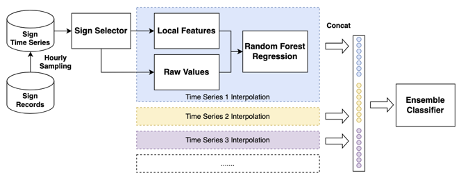
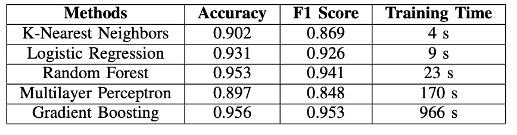
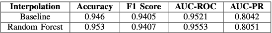
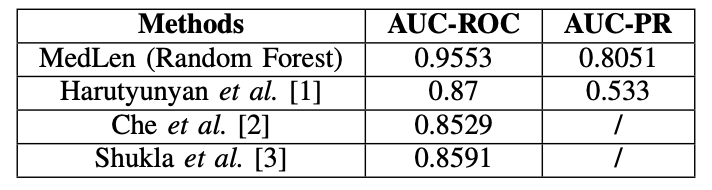

# MedLens: Improve mortality prediction via medical signs selecting and regression interpolation

This repository contains the code for the paper titled [MedLens: Improve mortality prediction via medical signs selecting and regression interpolation]()

## Overview

MedLens aims to improve patient health monitoring and mortality prediction by addressing the data-quality problem associated with clinical signs. After assessing the missing rate and correlation score across various medical signs and a large number of patient hospital admission records, MedLens applies an automatic vital medical signs selection approach via statistics and a flexible interpolation approach for high missing rate time series. The resulting ensemble classifiers boost the accuracy and reduce the computation overhead, achieving a high performance of 0.96 AUC-ROC and 0.81 AUC-PR.

## Citation

If you use this code in your research, please cite the following publication.

```
@article{ye2023medlens,
  title={MedLens: Improve mortality prediction via medical signs selecting and regression interpolation},
  author={Ye, Xuesong and Wu, Jun and Mou, Chengjie and Dai, Weinan},
  journal={arXiv preprint arXiv:2305.11742},
  year={2023}
}
```

Please be sure also to cite the original [MedLens Paper]()

## Architecture



## Results

Accuracy Performance and Time Consuming Across Various Classifiers




Performance Under Different Interpolation Methods



### Compare with previous works



## Prerequsites

The code requires the following Python packages:

- Python 3.x
- numpy
- pandas
- sklearn

## Installation & Usage

1. Clone this repository to your local machine.
2. Prepare the corresponding MIMIC III dataset.
3. Install the necessary Python packages listed in the Prerequisites section.
4. Run the following scripts in the order provided:
   - `top_itemid_selection.py` to select relevant items.
   - `extract_logs.py` to parse the dataset CSV files.
   - `generate_time_series_logs.py` to generate time series files.
   - `itemid_hospital_expire_correlation.py`, `missing_data_rates.py` for statistics.
   - `mortality_prediction.py` for interpolation and prediction.